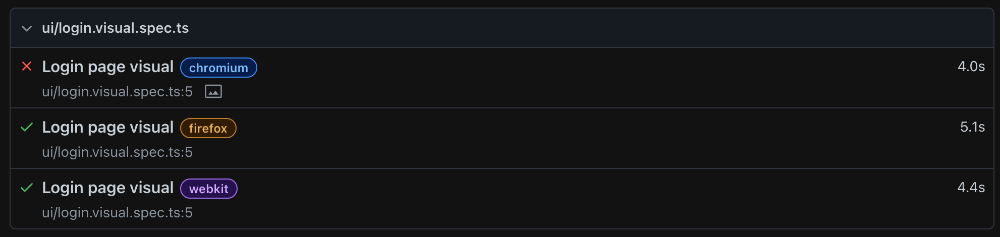
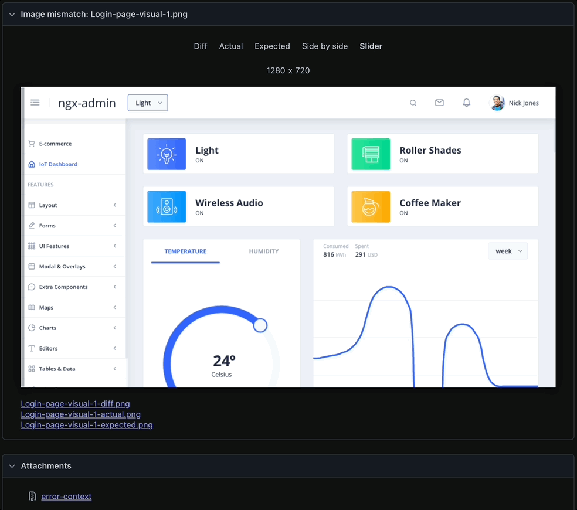
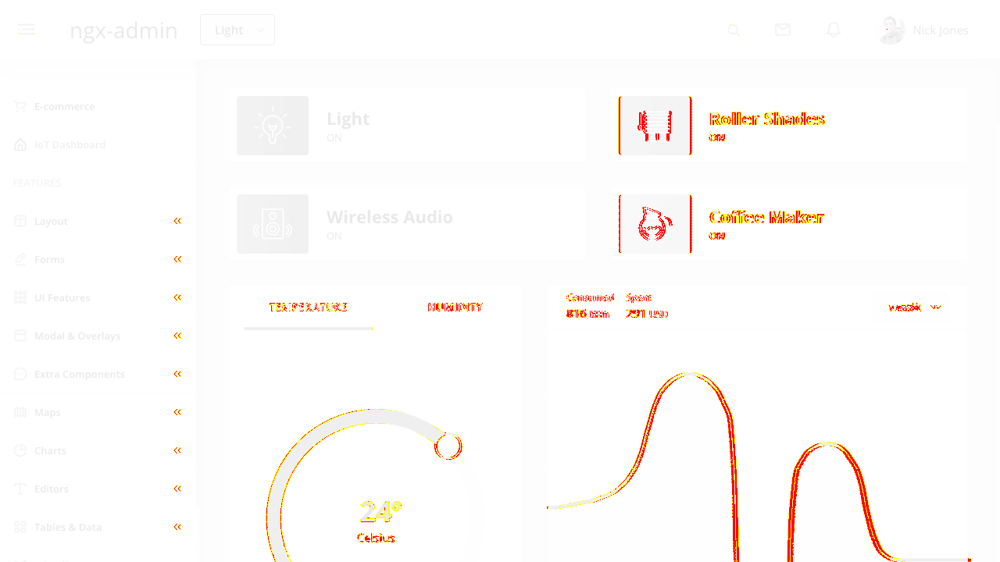
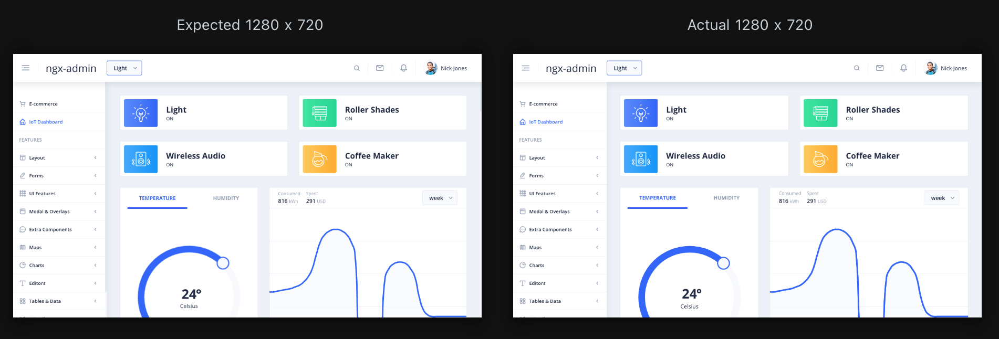
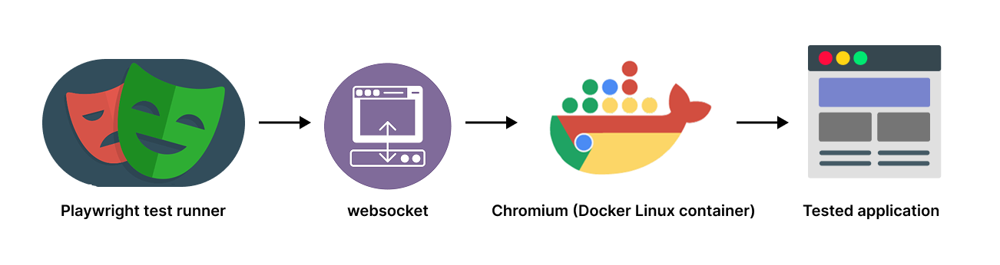

**VRT Playwright (Visual Regression Testing z wykorzystaniem Playwright).**

### Wyzwania w VRT
> [!NOTE]
> Visual Regression Testing porównuje piksele, a nie logikę aplikacji. Dlatego nawet drobne różnice w renderowaniu mogą generować fałszywe błędy.

Na załączonej poniżej animacji widać subtelne różnice w pozycjonowaniu elementów. W rezultacie otrzymaliśmy fałszywie pozytywny wynik (false positive) na jednej z przeglądarek.







1. Asynchroniczne renderowanie SPA (Angular / React / Vue)
Komponenty renderują się etapami (change detection, mikro-taski, lazy loading), co powoduje, że screenshot może zostać wykonany zanim UI osiągnie stabilny stan.

2. Różnice środowiskowe (OS / Docker / CI)
Różne systemy operacyjne, biblioteki systemowe i sterowniki mogą renderować tę samą stronę w nieco inny sposób.

3. Różne wersje przeglądarek
Nawet drobna zmiana wersji Chromium może wpływać na antyaliasing czcionek, łamanie tekstu, czy pozycjonowanie elementów o 1–2 px.

4. Animacje i przejścia CSS
Efekty typu fade, slide, spinner czy hover generują dynamiczne zmiany w czasie wykonywania screenshotu.

5. Dynamiczne dane
Daty, zegary, identyfikatory, dane z API czy feature flagi powodują, że widok nie jest deterministyczny.

6. Fonty i zasoby zewnętrzne
Brakujące lub różnie renderowane fonty (Mac vs Linux) to jedna z najczęstszych przyczyn fałszywych regresji wizualnych.


### Rozwiązania do zastosowania w tym projekcie

1. Stabilizacja DOM przed wykonaniem screenshotu - dodanie helpera waitForStableDom, który czeka aż DOM przestanie się zmieniać przez określony czas, zapobiega wykonywaniu screenshotu w trakcie renderowania SPA.

2. Konteneryzacja środowiska (Docker) - zapewnienie spójnej wersji systemu, przeglądarki i identycznego środowiska jak w CI.
Zastosowanie Remote Browser Pattern:
    (test -> websocket -> wspólny chromium -> screenshot (test runner ≠ browser environment)):
    - Kontener uruchamia jedną współdzieloną przeglądarkę Chromium jako serwer WebSocket
    - Testy NIE uruchamiają własnego browsera. Podłączają się do już działającego


3. Kontrola wersji przeglądarki - wykorzystanie przeglądarki dosterczonej przez playwright.

4. Izolacja dynamicznych elementów - mockowanie, ukrywanie, stabilizowanie przed wykonaniem screenshotu.

5. Ograniczenie wpływu animacji (Deterministyczne środowisko) - W razie potrzeby animacje mogą być wyłączane.

6. Zastosowanie metody minimalizującej liczbę fałszywie pozytywnych wyników poprzez racjonalne (0.002) użycie opcji .toHaveScreenshot({ maxDiffPixelRatio: 0.02 }).

### Goal
Osiągnięcie deterministycznego, powtarzalnego renderu UI przed wykonaniem zrzutu ekranu, tak aby testy wizualne wykrywały wyłącznie realne błędy w interfejsie.

___

## Run Guidelines
### Dwa tryby pracy
**Lokalnie**
  ```sh
  npm run test:vrt
  ```

**Przeglądarka z Dockera (deterministyczny VRT)**
http://localhost:9292 → Running (Remote Chromium browser server - przeglądarka jako usługa w kontenerze Linux
i wystawił ją jako WebSocket API dla Playwright.)
  ```sh
  npm run docker:build
  npm run docker:run 
  ```

Uruchom test:
  ```sh
  npm run test:vrt
  ```
  lub
  ```sh
  npx playwright test
  ```

___

## Architektura

